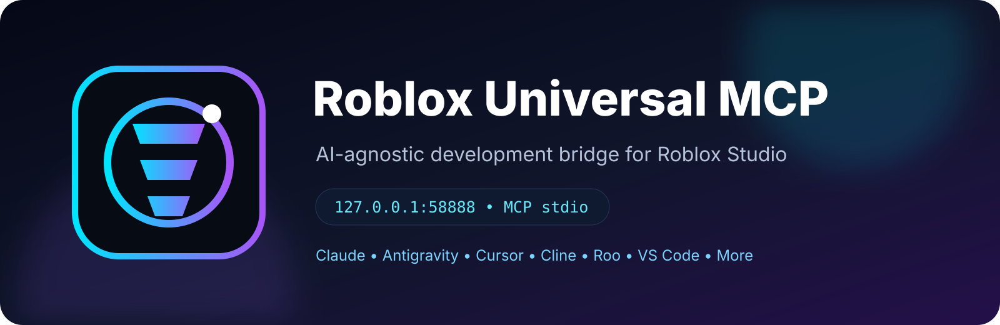

<div align="center">



# Roblox Universal MCP

### Build, debug, test, audit, and automate Roblox Studio with any MCP-capable AI.

<p>
  <a href="https://github.com/wongagung/MCPMainan/stargazers"></a>
  <a href="https://github.com/wongagung/MCPMainan/issues"></a>
  
  
  
</p>

<p>
  <a href="#-quick-start">Quick Start</a> •
  <a href="#-what-you-get">Features</a> •
  <a href="#-supported-ai-clients">AI Clients</a> •
  <a href="#-architecture">Architecture</a> •
  <a href="#-toolbox">Toolbox</a> •
  <a href="#-security-model">Security</a>
</p>

</div>

---

## ⚡ What is this?

**Roblox Universal MCP** is a local, AI-agnostic development layer for Roblox Studio.

Instead of maintaining a separate Roblox integration for every AI, one MCP server exposes a consistent toolset and a single Studio connector handles the Roblox side.

```text
┌─────────────────────────────────────────────────────────────────────────┐
│                         YOUR AI / MCP CLIENTS                            │
│ Claude • Antigravity • Cursor • Cline • Roo • VS Code • Other MCP AI    │
└─────────────────────────────────┬───────────────────────────────────────┘
                                  │
                              MCP / stdio
                                  │
                                  ▼
┌─────────────────────────────────────────────────────────────────────────┐
│                        ROBLOX UNIVERSAL MCP                             │
│  Tools • Autopilot • Memory • Tasks • Audits • Snapshots • Git          │
└─────────────────────────────────┬───────────────────────────────────────┘
                                  │
                      localhost RPC / token auth
                                  │
                           127.0.0.1:58888
                                  │
                                  ▼
┌─────────────────────────────────────────────────────────────────────────┐
│                     ROBLOX STUDIO CONNECTOR                             │
│  DataModel • Scripts • Selection • Output • Testing • Properties       │
└─────────────────────────────────┬───────────────────────────────────────┘
                                  │
                                  ▼
                           Your Roblox Project
```

> **One bridge. One toolset. Any MCP-capable AI.**

---

## ✨ What you get

| Area | Capabilities |
|---|---|
| 🧠 **AI-Agnostic MCP** | Standard MCP over stdio; independent from any specific model/provider. |
| 🌳 **Studio Control** | Inspect tree, search objects, selection control, create/delete instances, set properties. |
| 🧩 **Script Intelligence** | Read/write Script, LocalScript, ModuleScript and execute controlled Luau. |
| 🐞 **Live Diagnostics** | Capture Roblox Output, warnings, errors, and runtime state. |
| 🔍 **Auditing** | Project, performance, security and asset-reference audits. |
| 💾 **Safe Snapshots** | Create snapshots and preview restores with `dryRun`. |
| 🧪 **Automated Testing** | Play, Run and multiplayer test flows through Studio test APIs. |
| 🧠 **Project Memory** | Durable architecture notes, conventions, facts and known issues. |
| ✅ **Task Engine** | Track TODO / doing / done development tasks. |
| 🤖 **Autopilot** | Run bounded multi-step Roblox operations with validation. |
| 🔧 **Git Helpers** | Status, diff, commit and explicit push operations. |
| ⚙️ **Windows Installer** | One-click setup, config backup, plugin install and client detection. |

---

## 🤖 Supported AI clients

The server is designed for **any MCP-capable client**. The repository includes automatic configuration support for common Windows setups:

- Claude Desktop
- Claude Code / MCP-compatible Claude environments
- Google Antigravity
- Cursor
- Windsurf
- Cline
- Roo Code
- VS Code MCP integrations
- Other clients that can launch an MCP server over `stdio`

The AI does **not** need a Roblox-specific integration. It only needs to be able to start `server/index.mjs` as an MCP server.

---

## 🚀 Quick Start

### Option A — One-click Windows setup

Clone the repository to a permanent location:

```powershell
git clone https://github.com/wongagung/MCPMainan.git
cd MCPMainan
```

Then run:

```text
Install-Roblox-Universal-MCP.cmd
```

Run it as **Administrator** on first installation.

The installer will:

1. Check Node.js.
2. Install server dependencies.
3. Validate the MCP server.
4. Check port `58888`.
5. Install the Roblox Studio connector plugin.
6. Back up detected MCP configs before editing them.
7. Configure detected AI clients without deleting unrelated MCP servers.

Restart your AI clients and Roblox Studio afterward.

### Option B — Manual

Start the bridge/server manually:

```bat
run-roblox-mcp.cmd
```

Then enable the **Universal MCP** plugin in Roblox Studio.

---

## 🔌 Connection

The AI side uses **MCP stdio**.

The Roblox Studio side uses a loopback-only bridge:

```text
127.0.0.1:58888
```

Important: `58888` is **not** the MCP transport port. It is the local RPC channel between the MCP server and the Studio connector.

Check the port anytime with:

```bat
check-port-58888.cmd
```

---

## 🧰 Toolbox

### Studio

```text
studio_status
studio_tree
studio_search
studio_get_selection
studio_set_selection
studio_read_script
studio_write_script
studio_create_instance
studio_set_properties
studio_delete_instance
studio_execute_luau
studio_batch
```

### Diagnostics & audits

```text
studio_diagnostics
studio_runtime_output
studio_project_audit
studio_performance_audit
studio_security_audit
studio_asset_audit
```

### Safety & testing

```text
studio_snapshot_create
studio_snapshot_restore
studio_play_test
studio_stop_test
```

### Project intelligence

```text
project_memory_get
project_memory_update
task_list
task_create
task_update
```

### Git

```text
git_status
git_diff
git_commit
git_push
```

### Automation

```text
roblox_autopilot
```

---

## 🤯 What this enables

### Build systems from natural language

> “Create a VIP/VVIP system with gamepass checks, overhead tags, server validation and admin bypass.”

### Debug a live project

> “Find all WeatherSync scripts, inspect the Output errors, identify the root cause, patch it, and run a test.”

### Audit a map

> “Scan the whole place for unanchored parts, heavy particle emitters, suspicious remote patterns and asset references.”

### Run an AI development loop

```text
Plan
  ↓
Inspect
  ↓
Edit
  ↓
Snapshot
  ↓
Play Test
  ↓
Read Output
  ↓
Fix
  ↓
Validate
```

---

## 🛡️ Security model

Roblox Universal MCP is designed as a **local developer tool**, not a public network service.

- Bridge binds to `127.0.0.1`.
- Local plugin RPC uses a shared local token.
- Snapshot restores support `dryRun` previews.
- Restore does not silently delete unrelated instances.
- Git push is an explicit tool and is not automatically triggered by ordinary Studio edits.
- Generated AI client configuration is backed up before modification.

> **Never expose port `58888` to the public internet.**

---

## 📁 Repository layout

```text
MCPMainan/
├─ server/
│  ├─ index.mjs                         # MCP server / tool registry
│  ├─ bridge.mjs                        # Local Studio RPC bridge
│  └─ package.json
│
├─ plugin/
│  ├─ RobloxUniversalMCP.lua            # Roblox Studio connector
│  └─ README.md
│
├─ installer/
│  ├─ Install-Roblox-Universal-MCP.ps1
│  ├─ Install-RobloxUniversalMCPPlugin.ps1
│  └─ Uninstall-Roblox-Universal-MCP.ps1
│
├─ generated-configs/
│  └─ roblox-universal-mcp.json         # Generic client config
│
├─ docs/
│  ├─ INSTALL.md
│  ├─ CLIENT-CONFIGS.md
│  ├─ ARCHITECTURE.md
│  └─ FEATURES.md
│
├─ assets/
│  ├─ roblox-universal-mcp-logo.svg
│  └─ roblox-universal-mcp-banner.svg
│
├─ Install-Roblox-Universal-MCP.cmd     # One-click installer
├─ Uninstall-Roblox-Universal-MCP.cmd
├─ check-port-58888.cmd
├─ run-roblox-mcp.cmd
└─ README.md
```

---

## 🧭 Roadmap

- [x] AI-agnostic MCP server
- [x] Roblox Studio connector
- [x] Studio automation tools
- [x] Diagnostics and audits
- [x] Safe snapshots
- [x] Programmatic testing hooks
- [x] Project memory and tasks
- [x] Git integration
- [x] Bounded autopilot
- [ ] Visual viewport inspection
- [ ] Rich diff/preview UI inside Studio
- [ ] Multi-agent orchestration profiles
- [ ] Plugin update channel / self-updater
- [ ] Automated release packages

---

## 💙 Philosophy

**Roblox Studio should be an environment AI can operate, not just a window AI can talk about.**

This project aims to make the entire development loop—**inspect → build → test → debug → validate → ship**—available through a clean MCP interface.

---

<div align="center">

### Made for Roblox creators who want AI to actually build.

<a href="https://github.com/wongagung/MCPMainan">⭐ Star the repository</a> ·
<a href="https://github.com/wongagung/MCPMainan/issues">🐛 Report an issue</a> ·
<a href="https://github.com/wongagung/MCPMainan/discussions">💬 Discussions</a>

</div>
